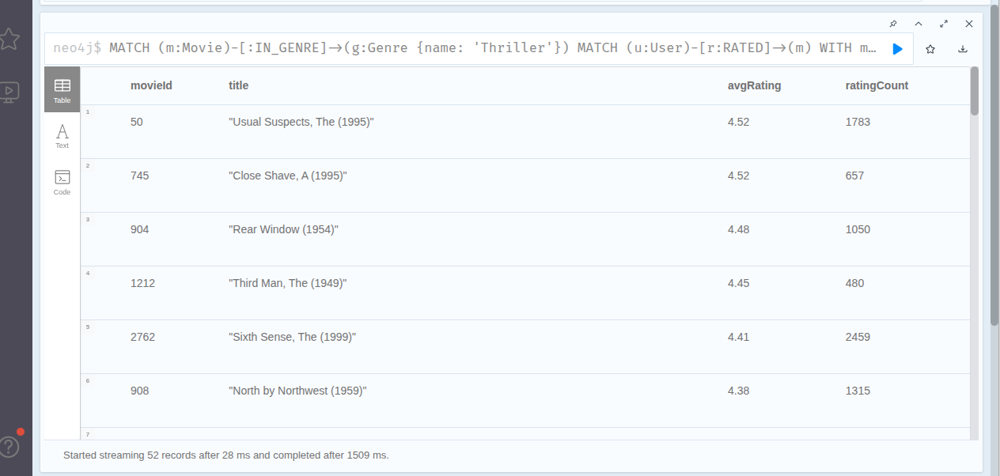
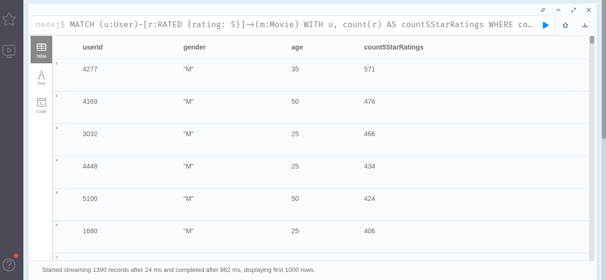
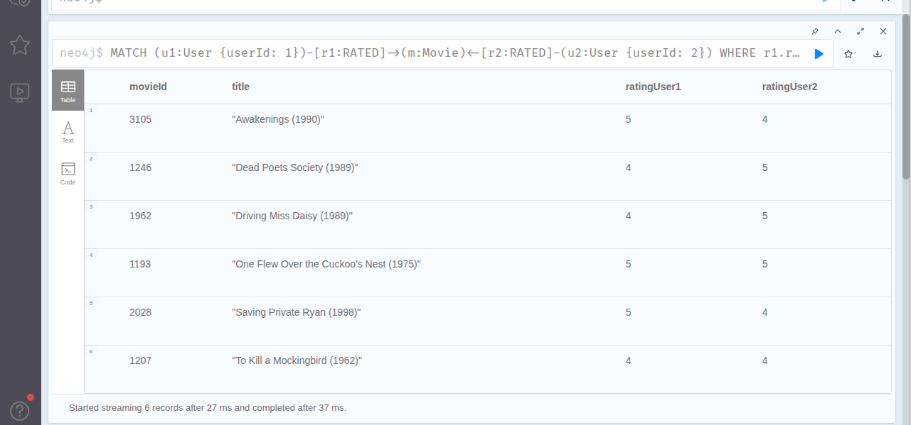
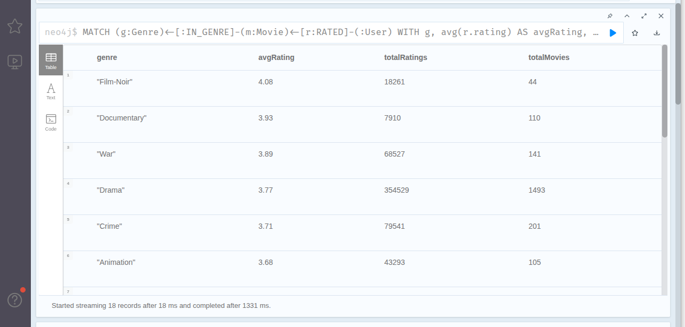
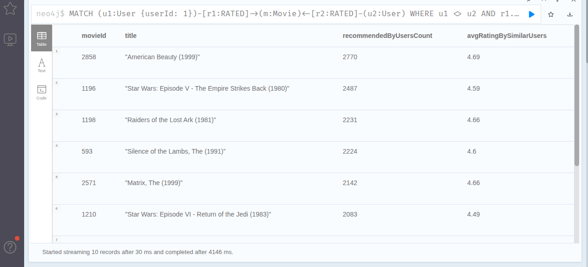
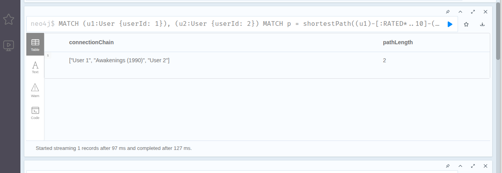
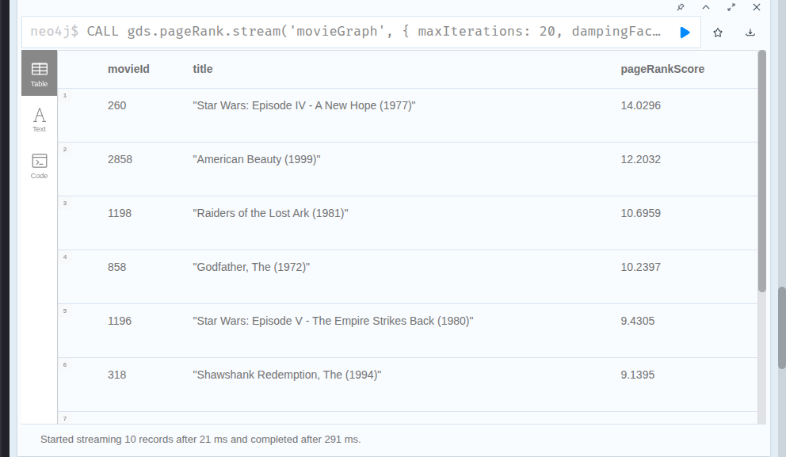
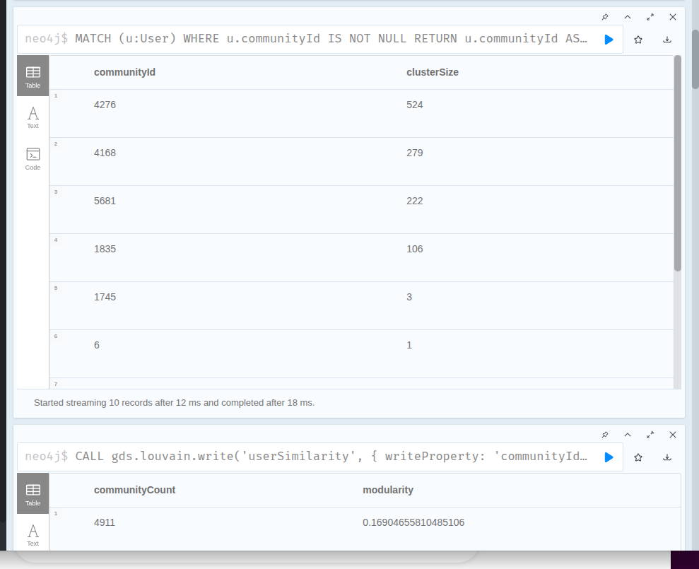
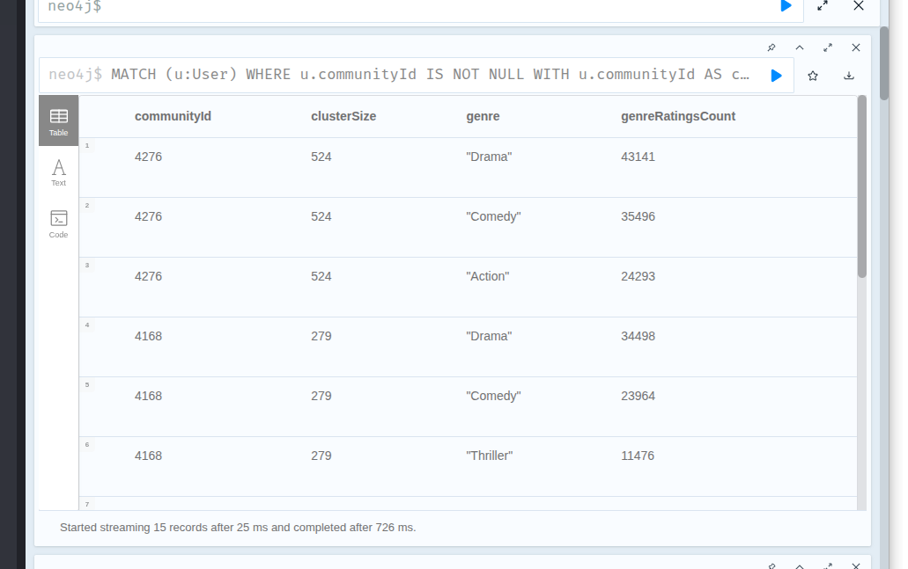
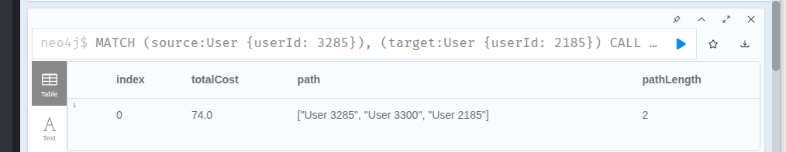

# Частина 1 — проєктування схеми

ASCII-діаграма схеми
```text
(:User)
   │
   ├── userId: INT [PK]
   ├── gender: STRING
   ├── age: INT
   └── occupation: INT
   │
   │  [:RATED {rating: INT, timestamp: INT}]
   ▼
  (:Movie)
   │
   ├── movieId: INT [PK]
   └── title: STRING
   │
   │  [:IN_GENRE]
   ▼
  (:Genre)
   │
   └── name: STRING [PK]
```

У нашій системі граф складається з трьох типів вузлів та двох типів зв'язків між ними: 

Вузли (Nodes):

- User (Користувач): представляє людину, яка дивиться та оцінює фільми. Властивості: userId (унікальний ідентифікатор), gender (стать), age (вік), occupation (професія), zipCode (поштовий індекс).

- Movie (Фільм): представляє кінострічку в каталозі. Властивості: movieId (унікальний ідентифікатор), title (назва).

- Genre (Жанр): представляє категорію кіно. Властивості: name (назва жанру, наприклад: Action, Comedy, Drama).

Зв'язки / Ребра (Relationships): 

- (User)-[:RATED]->(Movie): вказує, що користувач оцінив конкретний фільм. Напрямок - від користувача до фільму. Властивості ребра: rating (числова оцінка від 1 до 5) та timestamp (час виставляння оцінки).

- (Movie)-[:IN_GENRE]->(Genre): вказує, що фільм належить до певного жанру. Напрямок - від фільму до жанру.
Властивості ребра: відсутні (це чистий структурний зв'язок).


Відповіді на питання:

  1. Які сутності стали вузлами, а які - ребрами? Чому?

Вузли: User - користувач; Movie - фільм; Genre - жанр.

Це окремі об'єкти, які мають власні властивості та можуть існувати незалежно один від одного.

Ребра: RATED - показує, що користувач оцінив фільм; IN_GENRE - показує, до якого жанру належить фільм.

Ребра використовуються для зв'язків між вузлами.

  2. Оцінка користувача - це ребро RATED чи окремий вузол Rating?

Прийнято рішення зробити оцінку ребром:

(User)-[:RATED {rating, timestamp}]->(Movie)

Завдяки цьому простіше будувати запити, швидше знайти, які фільми оцінив користувач та не потрібно створювати окремий вузол для кожної оцінки, тому база займає менше пам'яті.

  3. Чому жанри краще зберігати як окремі вузли Genre, а не як список у Movie?

Окремі вузли жанрів мають кілька переваг:
- легко знайти всі фільми певного жанру;
- простіше знаходити схожі фільми через спільний жанр;
- не потрібно щоразу переглядати список жанрів у кожному фільмі.

Тому зберігати жанри як окремі вузли швидше та зручніше для пошуку і побудови рекомендацій.

# Частина 2 — Завантаження даних

Пояснення елементів Cypher-запитів в кроках:


Крок 1:


    CREATE CONSTRAINT ... REQUIRE ... IS UNIQUE:
    У Neo4j 5 створення унікального обмеження автоматично створює під ним RANGE індекс. Це гарантує відсутність дублікатів і прискорює пошук.

Крок 2:


    MERGE (u:User {userId: toInteger(...)}):
    Використання MERGE замість CREATE робить скрипт ідемпотентним (безпечним для повторного запуску). При повторному запуску вузли не будуть задвоюватися. Поля перетворюються з рядків на числа (toInteger).

    split(row.genres, '|') та UNWIND:
    Рядок жанрів "Animation|Children's|Comedy" розбивається у масив, а UNWIND розгортає його в окремі рядки. Потім MERGE (g:Genre) гарантує, що у нас буде точно 18 унікальних вузлів жанрів.
    
Крок 3:


    apoc.periodic.iterate:
    Завантажує 1 мільйон ребер пачками (батчами) по 10 000 записів в окремих транзакціях. Це запобігає переповненню оперативної пам'яті (Java Heap Space / OutOfMemory Error).


# Частина 3 — Запити різної складності

Запит 1. Знайти всі фільми жанру «Thriller» із середнім рейтингом вище 4.0

Запит спочатку знаходить усі фільми жанру Thriller, після чого для кожного з них обчислює середню оцінку та кількість отриманих оцінок. Далі залишаються лише ті фільми, середній рейтинг яких перевищує 4. Такий підхід дозволяє не рахувати середній рейтинг для всіх фільмів у базі, а працювати тільки з потрібним жанром.

<p align="center">
  
</p>

Запит 2. Знайти користувачів, які поставили оцінку 5 більш ніж 50 фільмам

У цьому запиті вибираються лише ті оцінки, які дорівнюють 5. Після цього вони групуються за користувачами, і для кожного підраховується кількість таких оцінок. Якщо користувач поставив більше 50 п'ятірок, він потрапляє до результату. Такий спосіб є простим і ефективним, оскільки непотрібні оцінки відсіюються відразу.

<p align="center">
  
</p>

Запит 3. Знайти фільми, які обидва користувачі (наприклад, userId=1 і userId=2) оцінили високо (рейтинг ≥ 4)

Запит знаходить фільми, які два задані користувачі оцінили на 4 або 5 балів. По суті він шукає перетин їхніх вподобань і показує лише ті фільми, що обом сподобалися. Завдяки індексу за userId пошук потрібних користувачів виконується швидко.

<p align="center">
  
</p>

Запит 4. Знайти жанри, чиї фільми стабільно отримують високі оцінки — середній рейтинг і кількість оцінок

Цей запит збирає статистику для кожного жанру. Він обчислює середній рейтинг, загальну кількість оцінок і кількість фільмів, що належать до жанру. У результаті можна побачити не лише те, які жанри є найпопулярнішими, а й те, як їх оцінюють користувачі.

<p align="center">
  
</p>

Запит 5. Рекомендація «користувачі зі схожими смаками також дивилися»: для заданого користувача знайти фільми, які він ще не дивився, але високо оцінили користувачі з подібними смаками

Запит працює за принципом пошуку схожих користувачів. Спочатку знаходяться люди, які високо оцінили ті самі фільми, що й обраний користувач. Потім серед їхніх оцінених фільмів шукаються ті, яких цей користувач ще не дивився. Чим більше схожих користувачів рекомендують певний фільм, тим вище він буде у списку рекомендацій. Це класичний підхід до побудови рекомендацій без використання додаткових алгоритмів машинного навчання.

<p align="center">
  
</p>

Запит 6. Знайти найкоротший ланцюжок зв’язку між двома користувачами через спільні фільми

Для цього використовується вбудована функція shortestPath(), яка знаходить найкоротший шлях між двома користувачами через наявні зв'язки в графі. Це дозволяє швидко визначити, як два користувачі пов'язані між собою, не реалізовуючи окремий алгоритм пошуку.

<p align="center">
  
</p>

Відповіді на питання:

1. Що означає довжина шляху в даному контексті?

Граф оцінок фільмів є дводольним (Bipartite Graph), тобто складається з двох типів вузлів — User та Movie. Ребра RATED існують лише між користувачами та фільмами, тому перейти безпосередньо від одного користувача до іншого неможливо.

Довжина шляху (path length) — це кількість ребер RATED, які потрібно пройти, щоб потрапити від одного користувача до іншого. Іншими словами, один хоп (hop) — це перехід по одному ребру графа.
   
2. Один хоп — це один крок по ребру RATED, а значить — шлях довжини 2 означає, що два користувачі оцінили один і той самий фільм?

Так. Шлях довжини 2 має вигляд:

User_A → Movie_1 ← User_B

Тут потрібно пройти лише два ребра RATED: від першого користувача до фільму і від цього фільму до другого користувача. Такий шлях означає, що користувачі A та B оцінили один і той самий фільм. Це найкоротший можливий шлях між двома користувачами в цій моделі, тому його можна розглядати як найсильніший зв'язок між ними.

3. Як інтерпретувати шлях довжини 4? Довжини 6?

Шлях довжини 4
User_A → Movie_1 ← User_B → Movie_2 ← User_C

У цьому випадку користувачі A і C вже не мають спільного фільму. Проте між ними є користувач B, який пов'язаний з обома: один фільм він оцінив разом із A, а інший — разом із C.

Тобто зв'язок між A та C є непрямим. Це означає, що їхні вподобання можуть бути схожими через спільного користувача, хоча безпосередньо вони не перетинаються.

Шлях довжини 6
User_A → Movie_1 ← User_B → Movie_2 ← User_C → Movie_3 ← User_D

Такий шлях означає ще більш віддалений зв'язок. Користувачі A та D не мають спільних фільмів і не пов'язані через одного користувача. Між ними існує ланцюжок із двох проміжних користувачів та трьох фільмів.

Подібний шлях показує, що користувачі можуть належати до різних груп за інтересами, але між ними все одно існує зв'язок через інших людей, які оцінювали різні фільми.

# Частина 4 — Виявлення супервузлів

Запит 1. Топ-10 найпопулярніших фільмів

Запит знаходить 10 фільмів, які отримали найбільшу кількість оцінок від користувачів. Для кожного фільму підраховується кількість зв'язків RATED, після чого результати сортуються за спаданням і повертаються лише перші десять записів. Це дозволяє визначити найпопулярніші фільми в базі даних.

Запит 2. Топ-10 найактивніших користувачів

Цей запит визначає користувачів, які залишили найбільше оцінок. Для кожного користувача підраховується кількість зв'язків RATED, а результати сортуються від найбільшого значення до найменшого. Разом із кількістю оцінок також виводяться основні дані про користувача, зокрема його стать і вік.

Запит 3. Аналіз жанрових супервузлів

Запит підраховує, скільки фільмів належить до кожного жанру. Для цього визначається кількість зв'язків між вузлами Genre і Movie, після чого жанри сортуються за кількістю пов'язаних із ними фільмів. Це допомагає побачити, які жанри найбільше представлені в наборі даних.

Запит 4. Пошук найбільш зв'язаних вузлів

Цей запит формує спільний рейтинг вузлів типів User, Movie та Genre за загальною кількістю їхніх зв'язків. Для кожного вузла визначається його ступінь, після чого результати сортуються за спаданням і виводяться найзв'язаніші вузли незалежно від їхнього типу. Це дає загальне уявлення про структуру графа та дозволяє швидко знайти вузли, які мають найбільшу кількість зв'язків.

Відповіді на питання:

1. Які вузли виявилися супервузлами? Скільки у них зв’язків?

Movie:

    Фільм "American Beauty (1999)" має 3,428 оцінок (його оцінили понад 56% усіх користувачів датасету).

    Фільми серії "Star Wars", "Jurassic Park", "Terminator 2" мають по 2,500 – 3,000 оцінок кожен.

User:

    Найактивніший користувач (userId: 4169) поставив 2,314 оцінок (продивився та оцінив понад 60% усього каталогу фільмів).

    Топ-10 користувачів мають від 1,300 до 2,300 оцінок кожен.

Genre (топ-3):

    Жанр Drama з'єднаний з 1603 фільмами.

    Жанр Comedy з'єднаний з 1200 фільмами.

    Жанр Action з'єднаний з 503 фільмами.


2. Чому запит, що зачіпає супервузол, працює повільніше, ніж запит по «звичайному» вузлу з тими самими індексами?

Індекс допомагає лише швидко знайти потрібний вузол, але після цього Neo4j повинен пройти всі його зв'язки. Якщо звичайний фільм має кілька десятків оцінок, то популярний може мати кілька тисяч. Через це база обробляє значно більше даних, особливо якщо запит проходить кілька рівнів графа. У результаті зростає час виконання запиту та використання пам'яті.

3. Конкретні стратегії оптимізації супервузлів для датасету MovieLens

Для жанрів краще використовувати їх як фільтр, а не будувати через них довгі шляхи, оскільки такі жанри, як Drama чи Comedy, пов'язані з дуже великою кількістю фільмів. Для популярних фільмів і дуже активних користувачів доцільно обмежувати кількість зв'язків, які використовуються під час пошуку рекомендацій. Також можна відбирати лише високі оцінки, щоб аналізувати менше даних і прискорити виконання запитів.

# Частина 5 — Графові алгоритми через GDS

5.1. PageRank на графі фільмів

Спочатку створюються ребра CO_RATED між фільмами, які мають багато спільних високих оцінок від одних і тих самих користувачів. Далі створюється проєкція графа в пам'яті GDS та запускається алгоритм gds.pageRank.stream. Обчислюється «авторитетність» фільмів у мережі. Фільм отримує високий бал не просто за кількість переглядів, а якщо його високо оцінили ті користувачі, які самі дивляться та оцінюють інші важливі стрічки.

<p align="center">
  
</p>

5.2. Виявлення спільнот (Louvain)

На основі матеріалізованих зв'язків схожості SIMILAR алгоритм Louvain автоматично розбиває користувачів на кластери (спільноти) за вподобаннями та записує їхній номер у властивість communityId. Після цього робиться агрегація, яка виводить ТОП-3 найпопулярніші жанри для кожного з найбільших кластерів. Це дозволяє сегментувати аудиторію на реальні групи за смаками та наочно перевірити, чим відрізняються уподобання різних груп.

<p align="center">
  
</p>

<p align="center">
  
</p>

5.3. Найкоротший шлях між користувачами

В алгоритм передаються два конкретні користувачі (які є в нашій вибірці). Алгоритм Дейкстри обходить граф схожості userGraph і знаходить між ними найкоротший ланцюжок з урахуванням ваги зв'язків (weight). Це наочно показує шлях між двома людьми через проміжних користувачів зі схожими смаками, демонструючи ефект «тісного світу» (Small World Network) у графі.

<p align="center">
  
</p>
